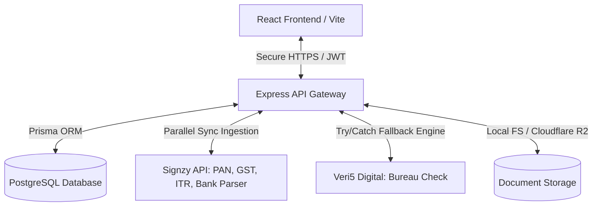
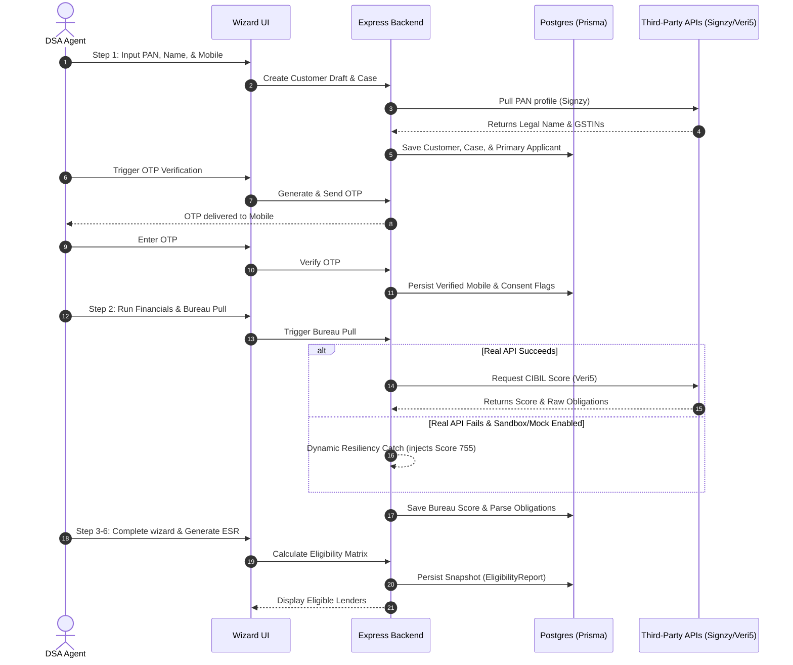
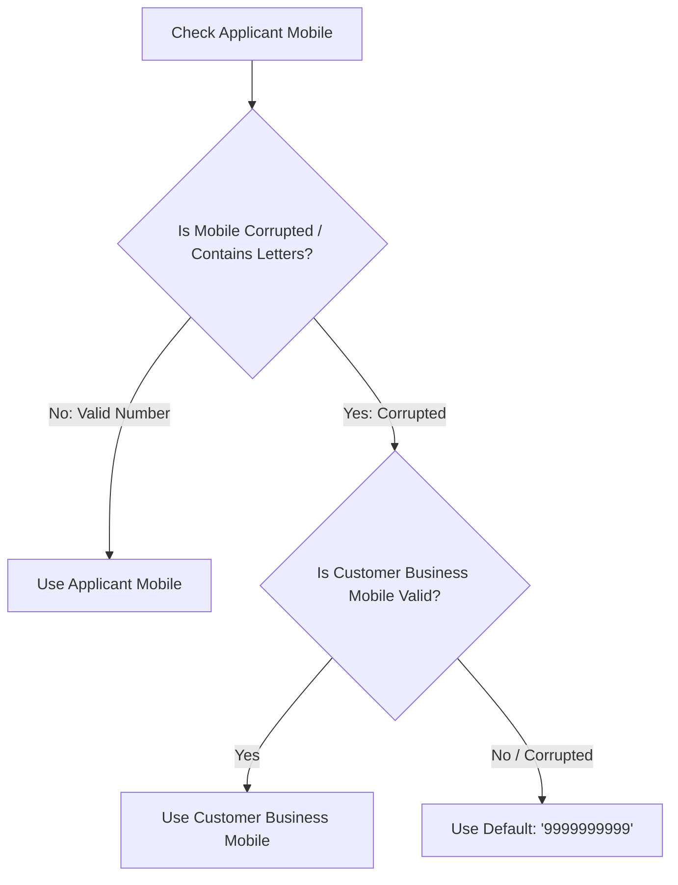
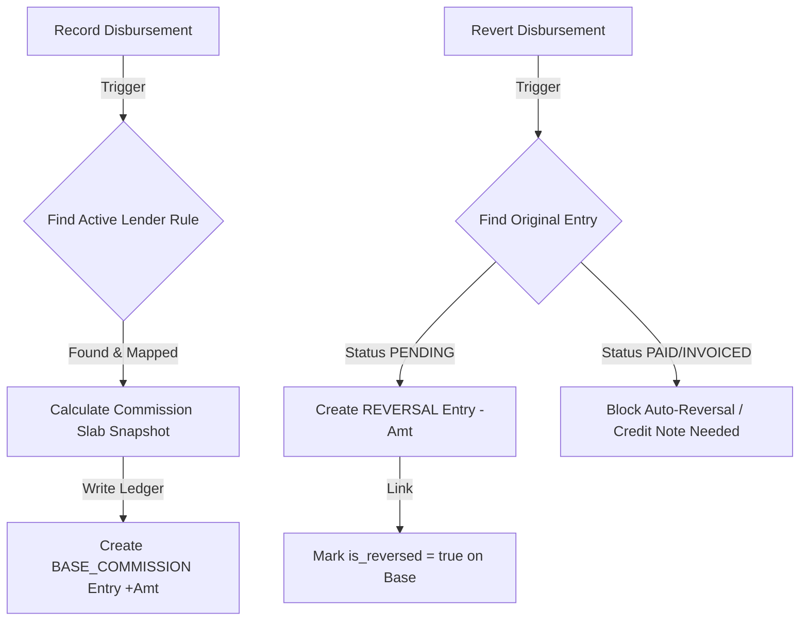

# Current System Architecture — Cred2Tech

> **Document Status:** Source of Truth (Updated with Hardened Onboarding, Verification, & Resiliency Layers)
> **Last Updated:** May 2026
> **Scope:** Decoupled React-Express Multi-Applicant Loan Origination & CRM Platform

---

## 1. System Topology & Core Stack

Cred2Tech operates as a high-fidelity B2B SaaS platform enabling Direct Selling Agents (DSAs) to manage loan applications (cases) under strict multi-tenant boundaries.



### 1.1. Backend (`/backend`)
*   **Core Engine:** Node.js + Express.
*   **Database Access:** PostgreSQL with Prisma ORM (`backend/prisma/schema.prisma`).
*   **Auth Strategy:** Stateless JWT-based authentication with Role-Based Access Control (RBAC).
*   **Resiliency Layer:** Try-catch mock fallbacks for flaky sandbox environments.
*   **Storage Adapter:** Pluggable local file storage system with pre-configured adapter for Cloudflare R2 bucket integration.

### 1.2. Frontend (`/frontend`)
*   **Framework Stack:** React 18 + Vite + TailwindCSS.
*   **Routing Matrix:** React Router v6 featuring code-splitted, lazy-loaded page modules.
*   **State & Session:** React Context API (`AuthContext`) paired with secure state-locking hooks to prevent high-frequency race conditions.

---

## 2. Platform Roles & Tenant Isolation Model

The database enforces a strict separation of scopes. A tenant represents a unique DSA organization.

### 2.1. System Roles
*   **SUPER_ADMIN:** Platform owner. Bypasses tenant isolation for administrative, analytics, global pricing matrices, and wallet allocation audits.
*   **DSA_ADMIN:** Organization owner. Full management control over organization team members, DSA credit wallet, and tenant-specific lender eligibility configurations.
*   **DSA_MEMBER:** Operational loan officer. Operates within tenant boundaries to create cases and perform validations. Banned from wallet adjustments or user provisioning.

### 2.2. Multi-Tenant Guardrails
*   **List Isolation:** All queries restrict matching criteria via Prisma, enforcing `where: { tenant_id: req.user.tenant_id }`.
*   **Drilldown Security:** Detail endpoints dynamically validate ownership before returning resource nodes:
    ```javascript
    if (req.user.role.name !== 'SUPER_ADMIN' && record.tenant_id !== req.user.tenant_id) {
       return res.status(403).json({ error: 'Forbidden' });
    }
    ```
*   **Wallet Isolation:** Single-wallet-per-tenant ledger architecture. Credit deductions occur in a serialized database transaction. The uniqueness check is scoped dynamically as `UNIQUE(tenant_id, api_code, idempotency_key)`, allowing identical transaction keys to operate across different tenants without collision.

---

## 3. End-to-End Onboarding & Verification Flow

The onboarding pipeline combines high-integrity data verification with progressive profile enrichment.



### 3.1. Detailed Flow Stages

#### Step 1: PAN, Contacts & Consent Verification
*   **Inputs:** Primary Applicant full name, PAN, mobile number, and email. Optional multi-applicant co-borrower configurations.
*   **Database State:** Generates a `Customer` record, a child `Case` record (`stage: DRAFT`), and automatically provisions the first `Applicant` record marked as `is_primary: true`.
*   **Verification Steps:**
    1.  **PAN Verification:** Queries Signzy’s Identity engine to retrieve the legal business/individual name and compile all registered GSTIN profiles.
    2.  **Consent OTP Verification:** Sends a 6-digit OTP to the applicant's mobile. Successful verification creates a validated database record with OTP consent timestamps.
*   **Stage Transition:** `DRAFT`

#### Step 2: Financial Integration & Document Analysis
*   **Inputs:** GST portal direct sync, digital ITR validation, and parallel multi-month bank statement uploads.
*   **Parallel OCR Batch Pipeline:** To prevent gateway timeouts and bypass vendor multipart constraints, the engine processes salary slips by executing separate, concurrent requests. A normalization layer handles formatting variations and strips non-numeric artifacts to extract the true net salary.
*   **Database State:** Updates `GstrAnalyticsRequest`, `ItrAnalyticsRequest`, and `BankStatementAnalysisRequest` rows. Changes the consolidated case flag in `CaseDataPullStatus`.
*   **Stage Transition:** `DATA_COLLECTION`

#### Step 3: Loan Product & Collateral Details
*   **Inputs:** Product selection (HL, LAP, WC, TL, ML, BL). If LAP or HL is selected, occupancy status, property type, ownership structure, and estimated market value are required.
*   **Database State:** Inserts or updates a dedicated `CasePropertyDetails` record linked to the case.
*   **Stage Transition:** `LEAD_CREATED`

#### Step 4: Consolidated Income Audit
*   **Inputs:** Review dynamically calculated summaries from GST, ITR, and Bank logs. Allows manual rows (e.g. Director Salary, Rental income) in `CaseIncomeEntry`.
*   **Computations:** Combined income is computed on the fly as `ITR Net Profit + Manual Additions`.
*   **Stage Transition:** `INCOME_REVIEWED`

#### Step 5: Bureau Score & Credit Obligations
*   **Inputs:** Triggers the Bureau pull to capture the CIBIL score and auto-populate all existing EMIs.
*   **Obligation Extraction:** Automatically parses the vendor response and creates `CaseCreditObligation` rows. Flagged entries with `emi_per_month = 0` are marked as `needs_verification: true` in the UI to require manual validation.
*   **Overrides:** Agents can edit EMIs or append new loans manually without mutating the original read-only raw bureau response.

#### Step 6: Eligibility Summary Report (ESR) Generation
*   **Process:** Evaluates the compiled case data against all active lender schemes (CIBIL limits, maximum FOIR, maximum LTV, minimum vintage, and product requirements).
*   **Database State:** Records the consolidated evaluation as a high-performance JSON snapshot inside `EligibilityReport`.
*   **Stage Transition:** `ESR_GENERATED`

---

## 4. Crucial Data Integrity & Resiliency Layers

To protect the platform against third-party API flakiness and input errors, several safety systems have been built into the core.

### 4.1. Non-Numeric Input Sanitization (Stop PAN-in-Mobile Corruption)
In earlier versions, PAN numbers were occasionally pasted into mobile number fields, leading to data corruption and downstream API failures. The system now enforces strict validation across the entire stack:

1.  **Frontend Input Enforcement:** Input fields in both [AddCustomerWizardPage.jsx](file:///d:/credtech/Cred2Tech/frontend/src/pages/AddCustomerWizardPage.jsx) and [AddSalariedCustomerWizardPage.jsx](file:///d:/credtech/Cred2Tech/frontend/src/pages/AddSalariedCustomerWizardPage.jsx) enforce numeric-only inputs via regex filters:
    ```javascript
    onChange={e => {
      const val = e.target.value.replace(/\D/g, ''); // Enforce digits only
      setFormData({...formData, business_mobile: val});
    }}
    ```
2.  **Session Restoration Cleansing:** When a case session is restored from the database, a sanitization routine instantly cleanses any legacy malformed numbers before they load into state:
    ```javascript
    business_mobile: (caseData.customer?.business_mobile || '').replace(/\D/g, ''),
    applicants: restoredApplicants.map(app => ({
      ...app,
      mobile: (app.mobile || '').replace(/\D/g, '')
    }))
    ```
3.  **Backend Controller Hardening:** As a final line of defense, backend controllers ([case.controller.js](file:///d:/credtech/Cred2Tech/backend/src/controllers/case.controller.js) and [customer.controller.js](file:///d:/credtech/Cred2Tech/backend/src/controllers/customer.controller.js)) intercept incoming payloads and strip non-numeric characters before DB interaction:
    ```javascript
    const mobileStr = mobile ? mobile.toString().replace(/\D/g, '') : null;
    ```

### 4.2. Bureau Pull Mobile Fallback Hierarchy
If a legacy record with a corrupted mobile field bypasses validation and triggers a Bureau pull, the system applies a dynamic fallback chain in [bureau.controller.js](file:///d:/credtech/Cred2Tech/backend/src/controllers/bureau.controller.js):



This prevents external vendor APIs from failing with standard validation errors, ensuring resilient case execution.

### 4.3. Verified Mobile Persistence
When an OTP is verified successfully, the verified mobile number is immediately saved directly to both the `Customer` and `Applicant` tables inside [otp.service.js](file:///d:/credtech/Cred2Tech/backend/src/services/otp.service.js). This ensures that once verified, the clean number becomes the database source of truth.

### 4.4. Bureau Service Mock Fallback (Sandbox Resiliency)
External sandbox environments can be slow or offline during active testing. The bureau service ([bureau.service.js](file:///d:/credtech/Cred2Tech/backend/src/services/externalApis/bureau.service.js)) implements an automatic fallback mechanism:

*   **Trigger:** If the real Veri5 Digital API call fails (due to timeout, server error, or IP blocking), the failure is caught.
*   **Condition:** If `process.env.BUREAU_MOCK_FALLBACK === 'true'` or the endpoint is a `sandbox` URL, the system logs the error and gracefully injects a mock successful CIBIL score response of `755`:
    ```javascript
    try {
      // Execute axios.post call...
    } catch (error) {
      if (process.env.BUREAU_MOCK_FALLBACK === 'true' || baseUrl.includes('sandbox')) {
        console.log(`[Bureau Service] Real API failed, falling back to MOCK SUCCESS for development.`);
        apiStatus = 'SUCCESS';
        score = "755";
        responsePayload = {
           status: { isSuccess: true, code: 200 },
           result: { status: "SUCCESS", verifiedData: { ResponseData: { data: { score: "755" } } } },
           mock: true
        };
      } else {
        throw error;
      }
    }
    ```

### 4.5. Vendor Name-Splitting Compliance
Third-party verification platforms often fail if name payloads contain middle names, multiple spaces, or non-alphabetic elements. To prevent this, the parsing engine in [bureau.controller.js](file:///d:/credtech/Cred2Tech/backend/src/controllers/bureau.controller.js) splits applicant names to extract only the first and last words, completely omitting middle name components:
```javascript
const nameParts = fullName.trim().split(/\s+/);
const firstName = nameParts[0] || 'Unknown';
const lastName = nameParts.length > 1 ? nameParts[nameParts.length - 1] : 'User';
```
*(Example: `"SUNIL KUMAR AGARWAL"` is parsed cleanly into `firstName: "SUNIL"` and `lastName: "AGARWAL"`, stripped of `"KUMAR"`).*

---

## 5. Post-Sanction Financials & Disbursement Lifecycle

Once a case is `APPROVED` by a lender, it enters the transaction management module.

### 5.1. Multi-Tranche Disbursement Architecture
Designed for commercial construction or MSME working capital loans, the system supports split payouts (tranches) while maintaining strict precision using the database `Decimal` type:

*   **CaseSanction:** Tracks terms (Sanctioned Amount, ROI, processing fees, Loan Account Number). Immutable once the first tranche is initiated.
*   **Disbursements (Tranches):** Individual payout records featuring an `idempotency_key` to block duplicate submissions and a `next_disbursement_due_date` to manage the pipeline.
*   **Post-Disbursement Documentation (PDD):** Generates checklist tasks (e.g., "Original Sale Deed Receipt", "Insurance Cover Note") linked to each tranche to track compliance.

### 5.2. Automatic Balance Synchronization
Every tranche update is executed within a database transaction to keep key metrics accurate:
$$\text{Remaining Balance} = \text{Sanctioned Amount} - \sum \text{Disbursed Tranches}$$
Stage transitions update automatically based on these calculations:
$$\text{APPROVED} \longrightarrow \text{PARTLY\_DISBURSED} \longrightarrow \text{DISBURSED}$$

---

### 5.3. Commission Ledger & Reversal Engine

Cred2Tech features a robust, historically immutable, append-only `CommissionLedger` system to track DSA partner earnings and employee payouts.



*   **Immutable Ledger Design:** Commission records are never mutated or deleted. Instead, the platform relies on an append-only architecture:
    *   **`BASE_COMMISSION`:** Created automatically upon a tranche disbursement. Reflects a positive commission value based on immutable snapshots of active lender commission slabs.
    *   **`REVERSAL`:** Created when a disbursement tranche is rolled back. Houses a negative commission value, links back to the original entry via `reversal_of_id`, and marks the original entry's `is_reversed` flag to `true` with reversal timestamps.
    *   **Status Protection:** Automatic reversals are strictly blocked if the original entry has already progressed to `INVOICED`, `PAID`, or `RECONCILED` status. Such cases are flagged for manual Credit Note intervention.
*   **Security & Tenant Isolation:** Ledger queries and updates strictly validate `{ tenant_id: req.user.tenant_id }` and enforce tree-level visibility using `hierarchy_path` so that DSA managers only view subtree payouts.
*   **Sales Incentive Dashboard:** An operational financials view groups active commission records by the case owner (`case_entity.created_by_user_id`), dynamically aggregates net payouts, and filters cases based on dynamic ledger creation dates.

---

## 6. Architecture Status & Future Extensions

Cred2Tech has matured from a simple "data pulling engine" into an integrated CRM and loan management platform.

### 6.1. Core Strengths
*   **Automated Eligibility:** Parametric evaluation of applications across multiple lenders in real-time.
*   **Reliability:** Strict multi-tenant isolation, automated data cleaning, name-splitting compliance, and mock fallback engines.
*   **Complete Lifecycle Support:** End-to-end flow from initial lead generation to multi-tranche post-sanction disbursements.
*   **Immutable Commission Ledger:** Resilient transactional commission calculations with automated ledger generation, positive/negative reversals, and manager hierarchy-tree reporting visibility.

### 6.2. Future Roadmap
*   **Integrated Invoicing:** Automatic invoice generation for lenders and partners based on the compiled ledger.
*   **Tenant Wallet Auto-topups:** Secure payment gateway integration for automated credit purchasing.
